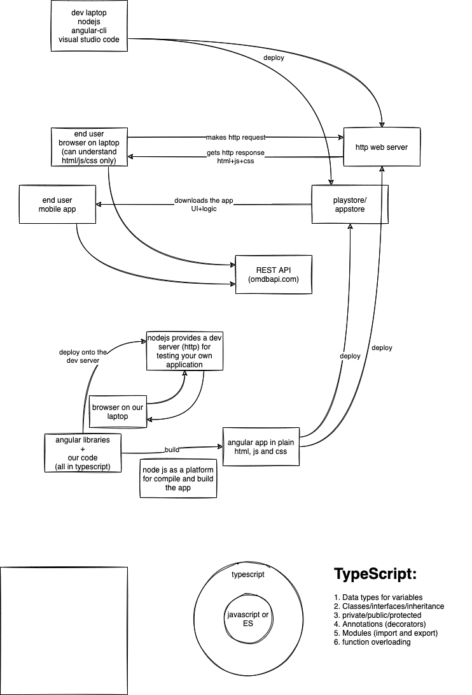
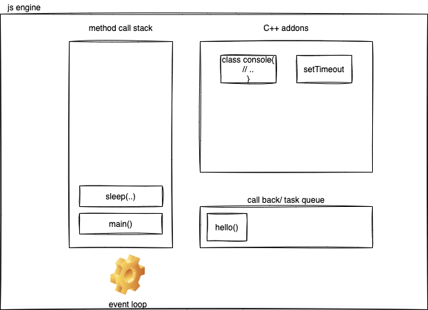
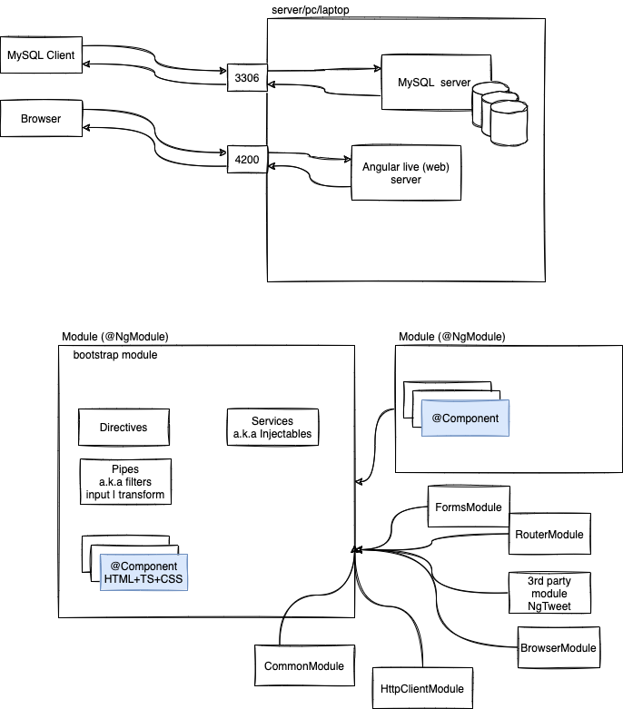
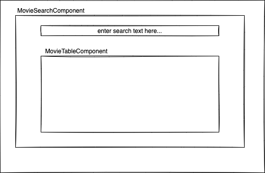
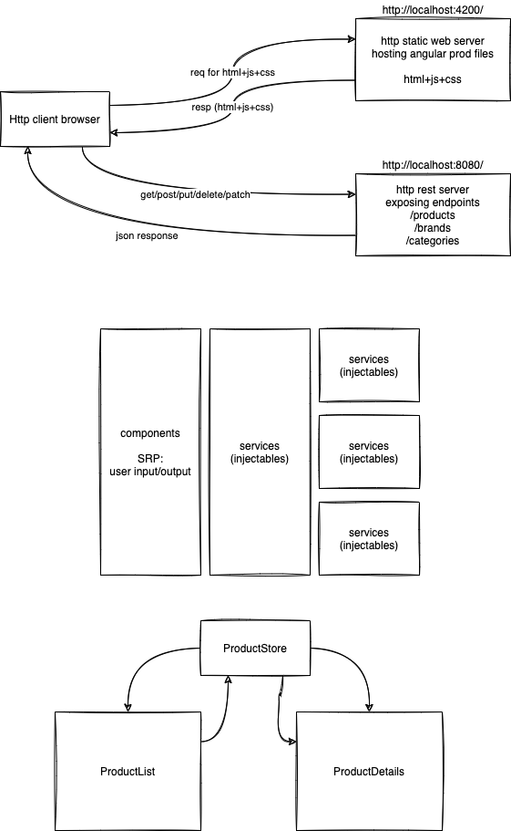

# Angular training for Epsilon October 2021 batch





### Some of the Angular CLI Commands:

To install angular cli, use the following command:

```sh
sudo npm install -g @angular/cli
```

To check the version of Angular CLI,

```sh
ng --version
```

To create a new Angular project

```sh
ng new angular-demo-app
```

To start the local build/deploy/start a dev server

```sh
ng serve -o
```






